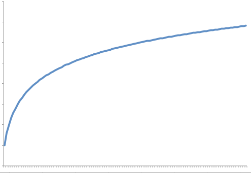
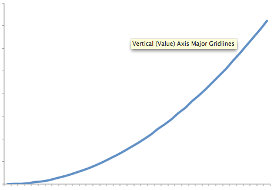
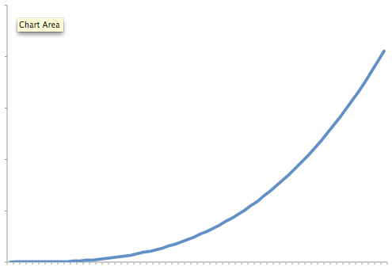

## Growth Rates

Algorithms analysis is all about understanding growth rates.  That is as the amount of data gets bigger, how much more resource will my algorithm require?  Typically, we describe the resource growth rate of a piece of code in terms of a function.  To help understand the implications, this section will look at graphs for different growth rates from most efficent to least efficient.

### Constant Growth Rate

A constant resource need is one where the resource need does not grow.  That is processing 1 piece of data takes the same amount of resource as processing 1 million pieces of data.  The graph of such a growth rate looks like a horizontal line

### Logrithmic Growth Rate

A logrithmic growth rate is a growth rate where  the resource needs grows by one unit each time the data is doubled.  This effectively means that as the amount of data gets bigger, the curve describing the growth rate gets flatter (closer to horizontal but never reaching it).  The following graph shows what a curve of this nature would look like.

### Linear Growth Rate

A linear growth rate is a growth rate where the resource needs and the amount of data is directly proportional to each other.  That is the growth rate can be described as a straight line that is not horizontal.

### Quadratic Growth Rate

A quadratic growth rate is one that can be described by a parabola.

### Cubic Growth Rate

While this may look very similar to the quadratic curve, it grows significantly faster

### Exponential Growth Rate

An exponential growth rate is one where each extra unit of data requires a doubling of resource.  As you can see the growth rate starts off looking like it is flat but quickly shoots up to near vertical (note that it can't actually be vertical)

