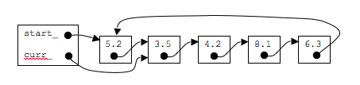
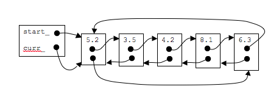

# Circular Linked List

Another method of implementing a linked list involves using a circular form so that the next_ pointer of the last node points back to the first node.

## Advantages of a circular linked list

* Some problems are circular and a circular data structure would be more natural when used to represent it
* The entire list can be traversed starting from any node (traverse means visit every node just once)
* fewer special cases when coding(all nodes have a node before and after it)

## Disadvantages of a circular linked list
* Depending on implementation, inserting at start of list would require doing a search for the last node which could be expensive.
* Finding end of list and loop control is harder (no NULL's to mark beginning and end)

## Picture of a singly linked circular linked list

## Picture of a doubly linked circular linked list

## Implementational Improvement

With a non-circular linked list, we typically have a pointer to the first item.  However, with a circular linked list (especially a singly linked one) this implementation may not be a good idea.  The reason for this is that if we point to the start of the list and we want to add/remove an item to the front, we would need to go through the entire list in order to find the last node so that we could keep the linked list hooked up properly.

One thing we could do is add another pointer to the list called last_ which points to the last node in the list.  However, this means that our object will have another pointer to worry about setting properly.

Another method of implementation is to forget about the start_ pointer entirely and just have a last_ pointer.  The reason for this is because if we point to just the last node, it is very very easy to find out what the first one was (remember start==last_->next_).
