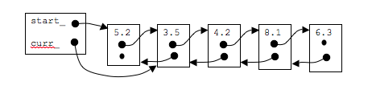

# Doubly Linked List

The previous linked list has a forward link only.  Thus, at any point we can find out what the next node is with relative ease but to find the previous node, you would need to start at the beginning and search for a node who's next pointer has the same value as curr_.

One improvement that you could make to your list is to create a doubly linked list.  A doubly linked list is a linked list where every node has both a forward and backwards

## The advantage of a doubly linked list

* No need to search entire list to find previous pointer
* Can move/search in both directions on list
* can access entire list from any point

## The disadvantages of a doubly linked list

* more memory is needed to store back pointer
* requires more work to set up back links properly

