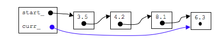
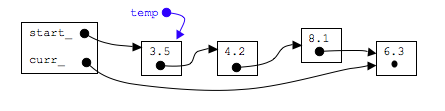
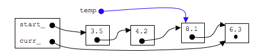
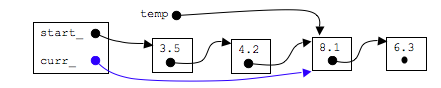
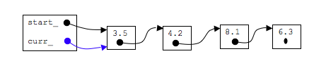

## goNext()

```c
curr_=curr_->next_;
```



## goPrev()

### step 1, after ensuring that curr is not pointing to first node, make a temp pointer to first node

```c
if(curr_!=start_){
  Node* temp=start_; //step 1
}
```


### step 2: move temp down the list

```c
while(temp->next_!=curr_){
    temp=temp->next_;
}
```


### step 3: point curr_ to same node as temp

```c
curr_=temp;
```


## goStart()
```c
curr_=start_;
```

