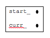

## Initialization

Typically a linked list starts off empty.  start_ and curr_ are both NULL.  The fact that start_ is NULL means that the list is empty.

### Initialization Code Segment

```c
start_=NULL;
curr_=NULL;
```


