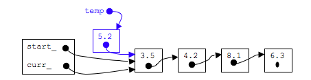
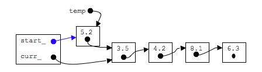
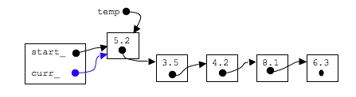

## insertion at start of list

### step 1: call goStart()

```c
goStart();
```


### step 2: make a new node

```c
curr_->next_=temp;
```



### step 3: make start point to new node


```c
curr_->next_=temp;
```


### step 3: point curr_ to new node

```c
curr_=temp;
```


