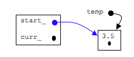
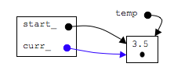

## Make the function call:  insertAfter(3.5);

Since the list is empty, all we need to do is create a new node and make start_ and curr_ point to it.  In the new node, the next_ pointer should be NULL as there is no next node:


### step 1: make a new node
```c
Node* temp=new Node;
temp->data_=newdata;
temp->next_=NULL;
```


### step 2: start_ pointer is null so make it point to new node

```c
start_=temp;
```




### step 3: make curr_ point to new node

```c
curr_=temp;
```


Note: temp is a local variable and thus it will go out of scope.  However, temp is just a pointer.  The pointer will go out of scope but the node with 3.5 will NOT go out of scope.
