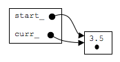
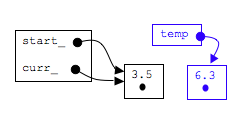
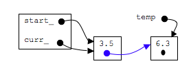
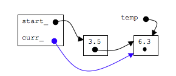

## Make the function call:  insertAfter(6.3);

In order to add to the list, we must create the node, make the next_ pointer of the node with 3.5 point to the newly added node, and make curr point to the new node.  Note that start_ doesn't change.  Also we must do it in order or we will lose the nodes involved

### Initial List:



### step 1: create a new node
```c
Node* temp=new Node;
temp->data_=newdata;
temp->next_=NULL;
```


### step 2: make the next pointer point to the new node
```c
curr_->next_=temp;
````


### step 3: make curr_ point to the new node
```c
curr_=temp;
````

