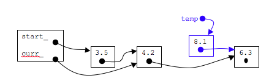
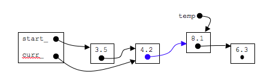
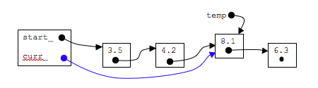

## Make the function call: insertAfter(8.1)

### step 1: Create an initialize new node

```c
Node* temp=new Node;
temp->data_=newdata;
temp->next_=curr_->next_;
```



### step 2: link new node into list

```c
curr_->next_=temp;
```


### step 3: point curr_ to new node

```c
curr_=temp;
```



