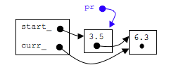
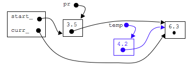
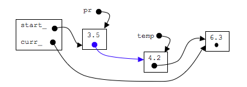
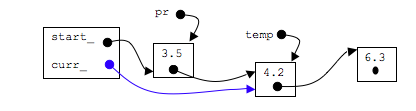

## Make the function call: insertBefore(4.2)

### step 1: create a temporary pointer that points to node before curr_

```c
Node* pr=prev();

```



### step 2: create a new node

```c

Node* temp=new Node;
temp->data_=newdata;
temp->next_=curr_;
```


### step 3: link up the node properly so that 3.5's next_ pointer points to new node

```c
pr->next_=temp;
```



### step 4: point curr_ at new node

```c
curr_=temp;
```

