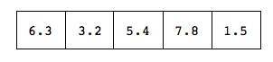
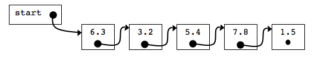

# Linked List

The linked list data structure is made up of multiple nodes.  Each node is made up of two portions, a data portion and a pointer portion.  The data portion contains one instance of the data to be stored.  While the pointer portion indicates the location of another node.

An array of 5 doubles:



A linked list storing the same data as the above array:




Each linked list must have a pointer to some node in the list.  Any other node in the list is reached by following the pointers from one node to the next.

Like an array, a linked list stores data of the same data type.  The data type of a linked list will determine how each node is declared.

## Node Declaration Examples

If we want to store some doubles our node declaration would be:
```c
struct Node{
  double data_;    // the data portion of the node
  Node* next_;     // a pointer to the next node
};
```

To create linked lists that hold other data types the data portion of a node would need to be a different data type.  You could have a linked lists that hold user defined data datatypes.

```c
class Hamster
  char name_[50];
  int age_;
public:
....
};

//Each node holds one instance of Hamster.
struct Node{
  Hamster data_;
  Node* next_;
};
```

Your linked lists can also be template classes.
```c
template <class TYPE>
struct Node{
  TYPE data_;
  Node<TYPE>* next_;
};
```

If you create a template node, you will also need to create a template list.

Even though we have used a struct to define a Node, it is also possible to use a class.  If you use a class to define a Node, you will need to write functions to access the data members.  Another method of handling a Node class is by using friends.  You could make the list a friend of your Node class so that access to data is restricted to the list.

Every list MUST have a pointer to a node in the list (usually the beginning).  This pointer should point to a node that will allow access to all the other nodes.  It may also be useful to have an internal pointer that could be used to manipulate the list.

### List Declarations

A linked list could be defined as the following.  (Note that there are other ways to encapsulate the idea of linked list.  This is just one way.):

class Llist{
  Node* start_;
  Node* curr_;
public:
....
};

The public member functions for a linked list should then provide methods for accessing and manipulating the data stored in the linked list.

In the following discusion we will assume we are writing a linked list of doubles

#### Functions for Node Access

```c
Node* start(); //returns a pointer to the first node
Node* curr();  //returns a pointer to the the current node
Node* next();  //returns a pointer to the node after the
               //current node.  If curr is NULL return NULL
Node* prev();  //returns a pointer to the node before the
               //current node.  If curr is NULL return NULL
int data(double& dat); //if the curr is not NULL, pass the
                       //data at the node back through dat

```

#### Functions for Manipulating the Linked List
```c
int goPrev(); /*make curr_ point at the previous node if
                possible.  If successful return true, otherwise
                return false*/

int goNext(); /*make curr_ point at the next node if possible.
                If successful return true, otherwise return
                false*/

void goStart(); /*makes the first node the current node*/

void goeEnd();   /*makes the last node the current node*/

int insertAfter(double newdata);
/*Insert a node after the current node containing newdata as the data for the node.  curr_ should point at the newly added node.  Return true for success, false for failure*/

int insertBefore(double newdata);
/*Insert a node before the current node containing newdata as the data for the node.  curr_ should point at the newly added node  Return true for success, false for failure*/

int remove();
/*Removes the node pointed to by curr_.  If the node removed was the last node in the list make curr_ point at the new last node.  Otherwise, curr_ should point at the node after one the one that was just removed.  returns true if successful, false if not*/

```

#### Initialization and cleanup

The list also needs to be properly initialized.  When the list goes out of scope, resources must be freed up.  Therefore a constructor and destructor is also needed

