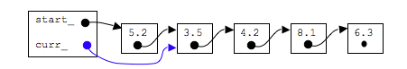
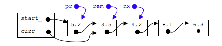
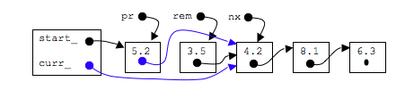
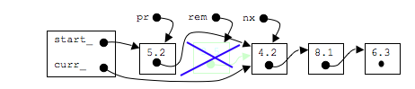

## remove second node


### step 1: call goNext()

```c
goNext();
```



### step 2: make 3 pointers that point to node before, node after, and current node

```c
Node* pr=prev();
Node* nx=next();
Node* rem=curr();

```



### step 3: point the next_ pointer of the previous node and curr_ to the node after the one we want to remove


```c
pr->next_=curr_=nx;
```


### step 4: deallocate the node

```c
delete rem;
```


