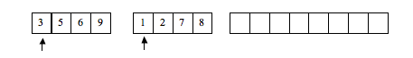
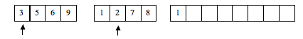
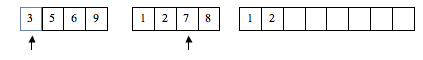
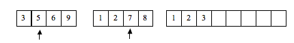
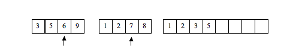
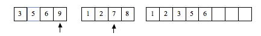
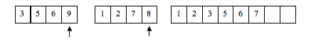
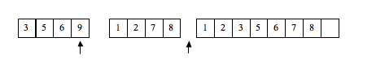
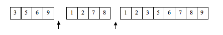

# Merge Sort

The merge sort works on the idea of merging two already sorted lists.  If there existed two already sorted list, merging the two together into a single sorted list can be accomplished in O(n) time.

## Merge algorithm:

The algorithm to do so works as follows:

* Have a way to "point" at the first element of each of the two list
* compare the values being pointed at and pick the smaller of the two
* copy the smaller to the merged list, and advance the "pointer" of just that list to the next item.
* Continue until one of the list is completely copied then copy over remainder of the rest of the list

### Example

Here we have 2 sorted lists.  Note that being already sorted is a must.  This algorithm does not work on unsorted lists.

look at first element of each list and find smaller, copy it to the resulting list, then advance pointer.

between 2 and 3, 2 is smaller:

between 3 and 7, 3 is smaller:

between 5 and 7, 5 is smaller:

between 6 and 7, 6 is smaller:

between 7 and 9, 7 is smaller:

between 8 and 9, 8 is smaller:

list 2 is now empty, copy rest of list 1 over

